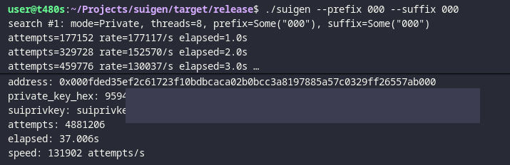

# suivanity



High-performance vanity address generator for the Sui blockchain.

## Address format constraints

A Sui address is `0x` followed by 64 hexadecimal characters.

Allowed characters are:
- `0 1 2 3 4 5 6 7 8 9`
- `a b c d e f`

## Features

- Prefix and suffix matching
- Multithreaded brute-force search
- Output mode: private key or mnemonic
- Native binary build for Linux and Windows

## Release binaries

You can download prebuilt binaries from the project Releases and run them directly.

Linux/macOS:

```bash
curl -L -o suivanity "https://github.com/venix756/suivanity/releases/latest/download/suivanity-linux-x86_64"
chmod +x suivanity
./suivanity --prefix cafe
```

Windows (PowerShell):

```powershell
curl.exe -L -o suivanity.exe "https://github.com/venix756/suivanity/releases/latest/download/suivanity-windows-x86_64.exe"
.\suivanity.exe --prefix cafe
```

## Usage

At least one matcher is required: `--prefix` or `--suffix`.

### Linux/macOS examples

```bash
./suivanity --prefix 1111
./suivanity --suffix beef
./suivanity --prefix ab --suffix ff
./suivanity --prefix 00 --mode mnemonic
./suivanity --prefix cafe --threads 8 --count 3
```

### Windows examples (PowerShell)

```powershell
.\suivanity.exe --prefix 1111
.\suivanity.exe --suffix beef
.\suivanity.exe --prefix ab --suffix ff
.\suivanity.exe --prefix 00 --mode mnemonic
.\suivanity.exe --prefix cafe --threads 8 --count 3
```

## CLI options

- `--prefix`, `-p`, `--starts-with`: hex prefix (optional `0x` is accepted)
- `--suffix`, `-s`, `--ends-with`: hex suffix (optional `0x` is accepted)
- `--mode`: `private` (default) or `mnemonic`
- `--threads`: worker thread count (default: CPU core count)
- `--count`: number of matches to find
- `--no-progress`: disable progress logs

## Output

Every match prints:
- `address`
- `private_key_hex`
- `suiprivkey` (Sui Bech32 private key format)
- `mnemonic` (only in `--mode mnemonic`)
- search statistics: `attempts`, `elapsed`, `speed`

## Build from source

Prerequisite: Rust toolchain installed (`rustup` + `cargo`).

```bash
cargo build --release
```

Run from source:

```bash
cargo run --release -- --prefix 0000
```

## Security notes

- Treat generated keys and mnemonics as sensitive secrets.
- Do not share terminal logs containing private material.
- Prefer generating wallets on a trusted local machine.
